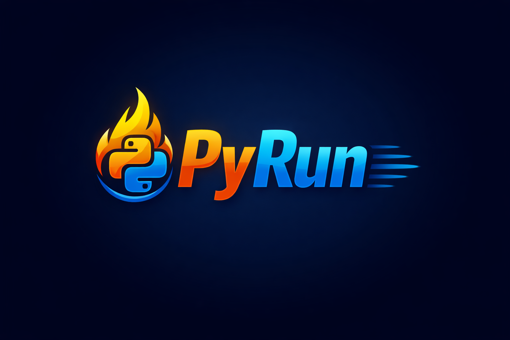

<p align="center">
  
</p>


# PyRun

> A modern CLI for managing and running Python projects

PyRun simplifies Python project setup, dependency management and
development server execution with automatic virtual environment handling
and reload behavior.

------------------------------------------------------------------------

## Why PyRun?

PyRun provides:

-   One-command project initialization
-   Automatic virtual environment creation
-   Structured dependency tracking via `modules.json`
-   Smart install, upgrade, and downgrade handling
-   Bulk dependency installation (`--all`)
-   Clean uninstall support
-   Framework-aware run commands
-   Host and port override support
-   Automatic server refresh on dependency changes

It brings a familiar, clean CLI experience to Python development.

------------------------------------------------------------------------

## Installation

Install globally via npm:

``` bash
npm install -g pyrun
```

Verify installation:

``` bash
pyrun --help
```

------------------------------------------------------------------------

## Quick Start

### 1. Initialize a Project

``` bash
pyrun init <framework> [path]
```

Example:

``` bash
pyrun init fastapi .
```

This will:

-   Create a `venv` virtual environment
-   Generate `modules.json`
-   Install required framework dependencies

------------------------------------------------------------------------

### 2. Run the Project

``` bash
pyrun run [entry-file] --port <port> --host <host>
```

Examples:

``` bash
pyrun run
pyrun run app.py
pyrun run app.py --port 3000
pyrun run app.py --host 0.0.0.0 --port 8000
```

PyRun automatically detects:

-   `app.py`
-   `main.py`
-   `manage.py`

Frameworks with native reload support use their internal reload
mechanisms for efficient development.

------------------------------------------------------------------------

### 3. Install Dependencies

Install one or multiple modules:

``` bash
pyrun install requests
pyrun install flask:2.0.1
pyrun install requests fastapi:0.110.0
```

Behavior:

-   Installs new modules
-   Updates versions if different
-   Downgrades when specified
-   Updates `modules.json`
-   Triggers server refresh when running

------------------------------------------------------------------------

### 4. Install All Project Dependencies

After cloning a project:

``` bash
pyrun install --all
```

This installs all dependencies defined in `modules.json`.

------------------------------------------------------------------------

### 5. Uninstall Modules

``` bash
pyrun uninstall requests
```

-   Removes the module from the virtual environment
-   Updates `modules.json`
-   Refreshes the server if running

------------------------------------------------------------------------

## Project Structure

After initialization:

    myproject/
    ├── venv/
    ├── modules.json
    ├── app.py | main.py | manage.py

------------------------------------------------------------------------

## modules.json Example

``` json
{
  "framework": "fastapi",
  "dependencies": {
    "fastapi": "0.110.0",
    "uvicorn": "0.29.0",
    "requests": "2.31.0"
  }
}
```

`modules.json` replaces traditional `requirements.txt` with structured
dependency tracking.

------------------------------------------------------------------------

## Supported Frameworks

-   Django
-   Flask
-   FastAPI
-   Plain Python

------------------------------------------------------------------------

## License

This project is licensed under the MIT License. See the [LICENSE](./LICENSE) file for details.

------------------------------------------------------------------------


